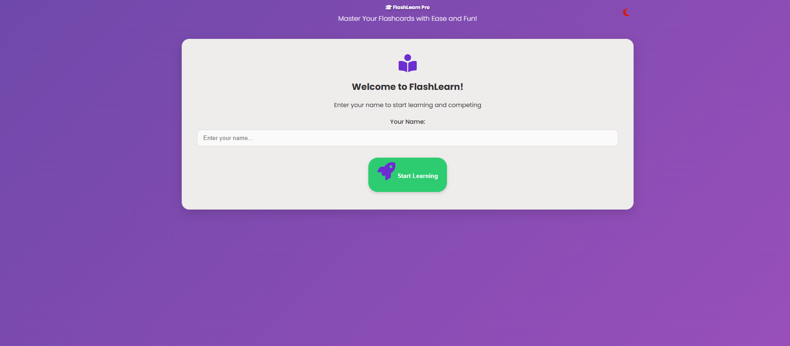
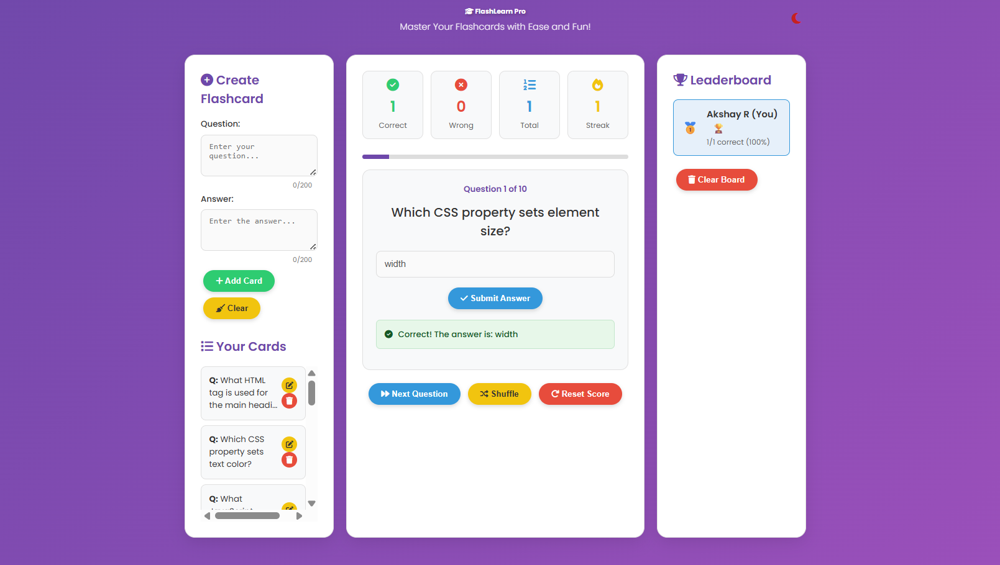

# 🚀 FlashLearn Pro


FlashLearn Pro is a **modern web-based learning application** designed to help users improve memory and learning efficiency using **interactive flashcards and quizzes**.

The application focuses on **active recall learning techniques** and provides a clean and responsive interface for studying and testing knowledge.

---

# 📚 Features

### 🧠 Interactive Flashcards

* Study concepts using flashcards
* Flip cards to reveal answers
* Helps improve memory retention

### ❓ Quiz Mode

* Test your knowledge through quizzes
* Instant feedback on answers
* Score tracking system

### ✏️ Custom Flashcards

* Users can create their own flashcards
* Personalized learning experience

### 🔥 Daily Streak System

* Track daily learning consistency
* Encourages regular study habits

### 🏆 Leaderboard

* Compare scores with other learners
* Creates a competitive learning environment

### 🌙 Dark Mode

* Toggle between light and dark themes
* Improves user experience during night study

### 📱 Responsive Design

* Works smoothly on desktop and mobile devices

---

# 🛠 Technologies Used

| Technology   | Purpose                      |
| ------------ | ---------------------------- |
| HTML5        | Structure of the application |
| CSS3         | Styling and layout           |
| JavaScript   | Application logic            |
| jQuery       | DOM manipulation             |
| Font Awesome | Icons                        |
| Google Fonts | Typography                   |

---

# 📂 Project Structure

```id="proj01"
Flashleran/
│
├── index.html
├── README.md
├── LICENSE
└── images
    ├── home.png
    └── quiz.png
```

---

# 🚀 Getting Started

Follow these steps to run the project locally.

### 1️⃣ Clone the repository

```id="clone01"
git clone https://github.com/yourusername/Flashleran.git
```

### 2️⃣ Navigate to the project folder

```id="nav01"
cd Flashleran
```

### 3️⃣ Run the project

Open the **index.html** file in any web browser.

No server setup or additional installations are required.

---

# 📸 Screenshots

### Home Page



### Quiz Interface



---

# 📄 License

This project is licensed under the **MIT License**.

---

# 👨‍💻 Authors

**Akshay R**
**Charan Kumar R**
